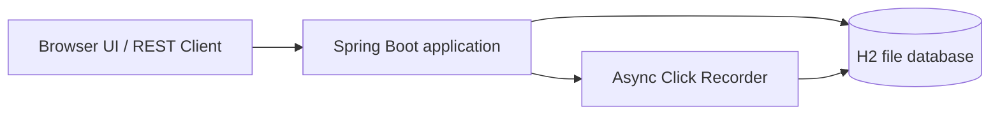

# AI Assisted URL Shortener

A Java, Spring Boot based application that converts a long HTTP or HTTPS URL
into a short, shareable URL and redirects the short URL to the original
destination.

The project demonstrates **engineer-led, AI-assisted software engineering**
across requirement analysis, decomposition, implementation, testing,
validation, scaling, and documentation.

## What the Application Does

```text
Long URL
   ↓
POST /api/v1/urls
   ↓
Validate the request
   ↓
Generate a seven-character Base62 code
or use an optional custom alias
   ↓
Store the code-to-URL mapping
   ↓
Return http://localhost:8080/{shortCode}
   ↓
GET /{shortCode}
   ↓
HTTP 302 redirect to the original URL
```

### Example

```text
Original URL:
https://www.example.com/articles/spring-boot-url-shortener-design

Generated short URL:
http://localhost:8080/aB3xY9Q
```

Opening the generated URL returns:

```http
HTTP/1.1 302 Found
Location: https://www.example.com/articles/spring-boot-url-shortener-design
```

## Base62 Short-Code Generation

When no custom alias is provided, `ShortCodeGenerator` creates a
seven-character code using `SecureRandom` and the following character set:

```text
0-9, a-z, A-Z
```

The service checks for existing codes and retries up to five times when a
collision occurs. A database unique constraint provides the final uniqueness
guarantee.

The internal database identifier remains a `Long`. Base62 is used only for the
public short code.

## Implemented Features

- Shorten valid HTTP and HTTPS URLs
- Generate seven-character Base62 short codes
- Support optional custom aliases
- Normalize aliases to lowercase
- Support optional expiration
- Redirect through HTTP `302 Found`
- Return HTTP `410 Gone` for expired links
- Deactivate a short URL through a soft-delete endpoint
- Track click count and last-accessed time
- Record detailed click events asynchronously
- Provide browser-based click analytics
- Validate URLs, aliases, dates, and malformed requests
- Return structured API errors
- Provide a static browser interface
- Use H2 for local and standalone execution
- Use a file-backed H2 database for local persistence
- List, search, edit, disable, and delete links from the browser interface
- Expose Actuator health and `X-App-Instance`
- Include automated tests

## Architecture



### Runtime

| Profile | Database | Storage | Purpose |
|---|---|---|---|
| Default | H2 | `./data/urlshortener` | Local development |

H2 persists application data to the local filesystem. The `data` directory is
created automatically when the application starts.

### Redirect Flow

```text
GET /{shortCode}
   ↓
Read the mapping from H2
  ↓
Validate active and expiration state
   ↓
Atomically update click count and last-accessed time
   ↓
Record detailed click event asynchronously
   ↓
Return HTTP 302 redirect
```

## Technology Stack

| Area | Technology |
|---|---|
| Language | Java 17 |
| Backend | Spring Boot, Spring Web MVC |
| Persistence | Spring Data JPA, Hibernate |
| Local database | H2 |
| Database | H2 file database |
| Validation | Jakarta Validation |
| Monitoring | Spring Boot Actuator |
| Testing | JUnit 5, Mockito, MockMvc, integration tests |
| Build and deployment | Maven Wrapper |

## API Reference

Base URL:

```text
http://localhost:8080
```

### Create a Short URL

```http
POST /api/v1/urls
Content-Type: application/json
```

Only `originalUrl` is required.

```json
{
  "originalUrl": "https://www.example.com/articles/spring-boot-url-shortener-design",
  "expiresAt": "2027-01-01T00:00:00Z",
  "customAlias": "spring-guide"
}
```

Successful creation returns HTTP `201 Created`.

### Redirect

```http
GET /{shortCode}
```

Successful resolution returns HTTP `302 Found` with the original URL in the
`Location` header.

### Aggregate Analytics

```http
GET /api/v1/urls/{shortCode}/analytics
```

Returns link metadata, click count, creation time, last-accessed time, active
state, and expiration.

### Detailed Click Analytics

```http
GET /api/v1/urls/{shortCode}/click-analytics
```

Returns total clicks, unique visitors, and browser, device, operating-system,
and country breakdowns. Detailed events are persisted asynchronously, so this
endpoint is eventually consistent.

### Deactivate a Short URL

```http
DELETE /api/v1/urls/{shortCode}
```

Successful deactivation returns HTTP `204 No Content`. The link remains in the
management table as disabled and stops resolving on redirect.

### Manage Links

```http
GET /api/v1/urls
```

Returns all links with their short URL, destination, status, click count, and
timestamps for the Manage Links table.

### Edit a Short URL

```http
PUT /api/v1/urls/{shortCode}
Content-Type: application/json
```

Updates the destination and optional expiration while preserving the short code.

### Permanently Delete a Short URL

```http
DELETE /api/v1/urls/{shortCode}/permanent
```

Permanently removes the link and returns HTTP `204 No Content`.

### Health

```http
GET /actuator/health
```

## Validation and HTTP Statuses

| Input | Rule |
|---|---|
| `originalUrl` | Required, maximum 2,048 characters, absolute `http://` or `https://` URL with a valid host; credentials, fragments, whitespace, control characters, and unsafe delimiters are rejected |
| `customAlias` | Optional, 4–30 characters, letters, digits, hyphens, and underscores |
| `expiresAt` | Optional, complete ISO-8601 date-time in the future |

Custom aliases are trimmed, converted to lowercase, checked for uniqueness,
and rejected when they conflict with reserved application paths.

| Status | Meaning |
|---|---|
| `201` | Short URL created |
| `302` | Redirect to original URL |
| `400` | Validation failure or malformed request |
| `404` | Short code or resource not found |
| `409` | Custom alias conflict |
| `410` | Short URL expired |
| `503` | Unique code could not be generated after retries |

## AI-Assisted Engineering Workflow

| Phase | AI Support | Engineering Ownership |
|---|---|---|
| Requirements | Organized requirements and surfaced ambiguities | Confirmed scope and acceptance criteria |
| Decomposition | Proposed tasks and dependencies | Prioritized and approved the sequence |
| Design | Suggested API, persistence, and local execution options | Selected architecture and trade-offs |
| Implementation | Assisted with scaffolding and debugging | Reviewed, corrected, and integrated the code |
| Testing | Suggested unit, integration, validation, and performance cases | Added project-specific cases and verified results |
| Documentation | Drafted explanations and structure | Reconciled claims with code and evidence |

```text
Requirement analysis
   ↓
Prompt with intent, constraints, and acceptance criteria
   ↓
Generated design or implementation draft
   ↓
Engineering review and correction
   ↓
Testing and validation
   ↓
Final approval
```

## Engineering Scenarios

### Greenfield

The first version established URL creation, redirects, H2 persistence,
validation, Base62 generation, and aggregate analytics.

### Brownfield

The working service was incrementally extended with expiration, custom aliases,
a soft-delete endpoint, and asynchronous detailed analytics.

### Ambiguous Requirement

The phrase “memorable short links” was clarified before implementation. The
approved interpretation was an optional, lowercase, validated, unique custom
alias that cannot conflict with reserved routes.

## Testing

Recorded Maven result:

```text
Tests: 82
Failures: 0
Errors: 0
Skipped: 0
```

Coverage includes:

- Base62 generation and collision handling
- URL creation and redirects
- Expiration
- Custom aliases
- Soft-delete (deactivation) and its interaction with redirects
- Aggregate and detailed analytics
- H2-backed persistence and analytics
- Browser detection
- Validation and structured errors
- SQL-injection-style and XSS-style input
- End-to-end integration flows
- Application-instance headers

### Static Analysis

`maven-checkstyle-plugin` and `spotbugs-maven-plugin` are wired into
`pom.xml` as report-only gates (they do not fail the build). The current
baseline is 358 Checkstyle violations (default Sun Checks ruleset) and 6
SpotBugs findings (all Medium severity, mutable-field exposure patterns).
Neither baseline has been remediated yet — see Future Scope below.

## Design Trade-Offs

- **Base62 instead of UUIDs:** shorter public URLs, with collision checks and
  bounded retries.
- **File-backed H2:** simple persistence without external services.
- **Synchronous aggregate analytics:** immediate count consistency, with one
  database write per successful redirect.
- **Asynchronous detailed analytics:** protects redirect reliability, with
  brief eventual consistency.
- **Single local instance:** keeps the prototype easy to run and inspect.
- **HTTP 302 redirects:** retains control over analytics and expiration rather
  than encouraging permanent client caching.

## Future Scope

The current prototype does not include the following. Each is a deliberate
deferral rather than an oversight — none were justified by the prototype's
actual requirements at this stage:

- **Authentication and authorization** — introduce Spring Security with JWT
  or OAuth2 (e.g. Keycloak or an external IdP) to authenticate API clients
  and gate mutating endpoints.
- **User ownership** — add a `users` table and an `ownerId` foreign key on
  `ShortUrl`, scoping create/read/analytics endpoints to the authenticated
  user.
- **Rate limiting and abuse prevention** — protect the create and redirect
  endpoints from high-volume or malicious traffic.
- **Alias update API** — changing an existing short code remains deferred;
   destination and expiration updates are supported.
- **Custom domains** — support short links served from domains other than
  the deployed application host.
- **Cleanup scheduler** — periodically archive or purge expired and
  deactivated short URLs instead of leaving them in place indefinitely.
- **Durable message-queue delivery** — replace the `@Async` click-event
  path with a durable broker (e.g. Kafka or RabbitMQ) so event persistence
  survives instance restarts and can be retried.
- **Schema migrations** — introduce Flyway or Liquibase instead of relying
  on JPA schema generation.
- **Static-analysis remediation** — address the current Checkstyle and
  SpotBugs baseline (see Static Analysis above); both gates are currently
  report-only.

## Project Structure

```text
url-shortener/
├── src/main/java/com/assignment/urlshortener/
│   ├── config/
│   ├── controller/
│   ├── dto/
│   ├── entity/
│   ├── exception/
│   ├── repository/
│   ├── service/
│   └── util/
├── src/main/resources/
│   ├── static/
│   └── application.properties
├── src/test/java/com/assignment/urlshortener/
├── documents/
├── pom.xml
├── mvnw
├── mvnw.cmd
└── README.md
```

## Running the Project

The application runs locally with Java 17 and a file-backed H2 database.

Complete macOS, Linux, and Windows instructions are available in
[`documents/04-setup-instructions.md`](documents/04-setup-instructions.md).

## Documentation

- [`04-setup-instructions.md`](documents/04-setup-instructions.md)
- [`05-ai-assisted-engineering-log.md`](documents/05-ai-assisted-engineering-log.md)

## Final Deliverables

- Runnable URL Shortener service and browser interface
- Long URL shortening with seven-character Base62 codes
- Direct HTTP redirects to original URLs
- Aggregate and detailed analytics
- Optional expiration, custom aliases, and soft-delete
- Manage Links table with edit, disable, and permanent delete actions
- Validation and structured error handling
- H2 local and standalone execution
- File-backed H2 persistence
- Local setup and testing documentation


## Author 

Aditi Verma
